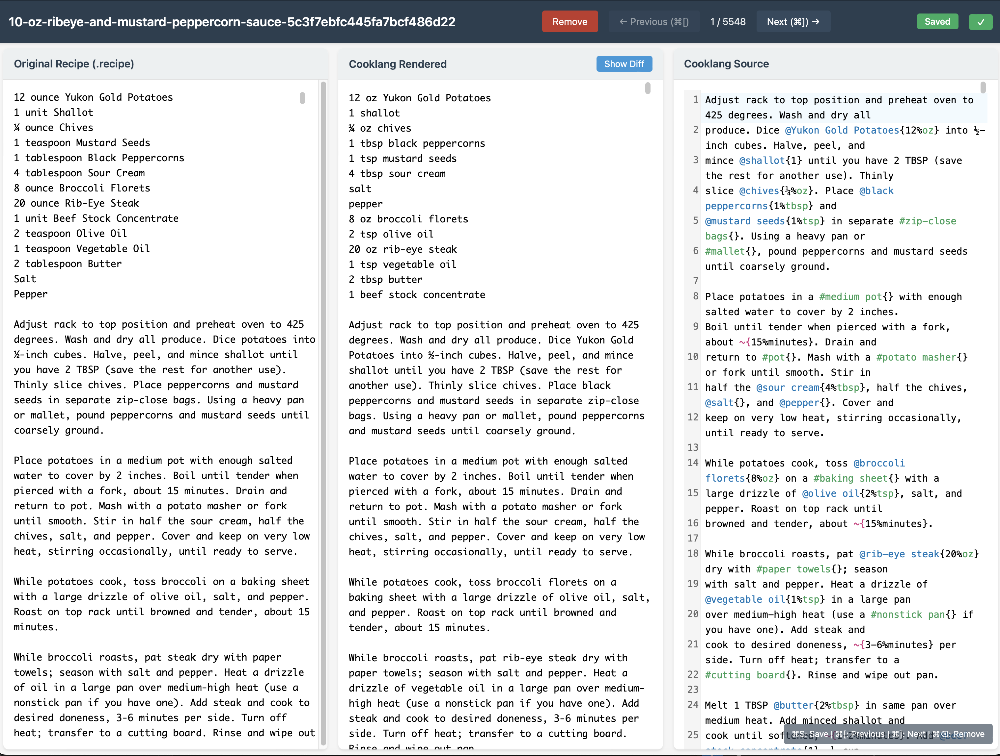

# Labler — Cooklang Recipe Validator

A web-based tool for reviewing and correcting `.recipe` → `.cook` conversions side-by-side. Built with Rust (Actix-Web) and the official Cooklang parser.



## Features

- Three-panel layout: original `.recipe` source, rendered Cooklang output, and Cooklang source editor
- Syntax-highlighted Cooklang editor (CodeMirror 6)
- Real-time parsing with error/warning display
- Diff view comparing original and rendered output
- Auto-save with dirty state indicator
- Keyboard-driven navigation between recipes

## Usage

```sh
# From the labler/ directory:

cargo run                      # All recipes (defaults to ../recipes)
cargo run -- ../recipes/us     # Only US recipes
cargo run -- ../recipes/gb     # Only GB recipes
```

Then open http://localhost:8080.

## Keyboard Shortcuts

| Shortcut | Action |
|----------|--------|
| `⌘S` | Save |
| `⌘[` | Previous recipe |
| `⌘]` | Next recipe |
| `⌘⌫` | Remove current recipe |

## Dependencies

Requires the [cooklang-rs](https://github.com/cooklang/cooklang-rs) parser checked out at `../../cooklang-rs` (i.e. `~/Cooklang/cooklang-rs`).
